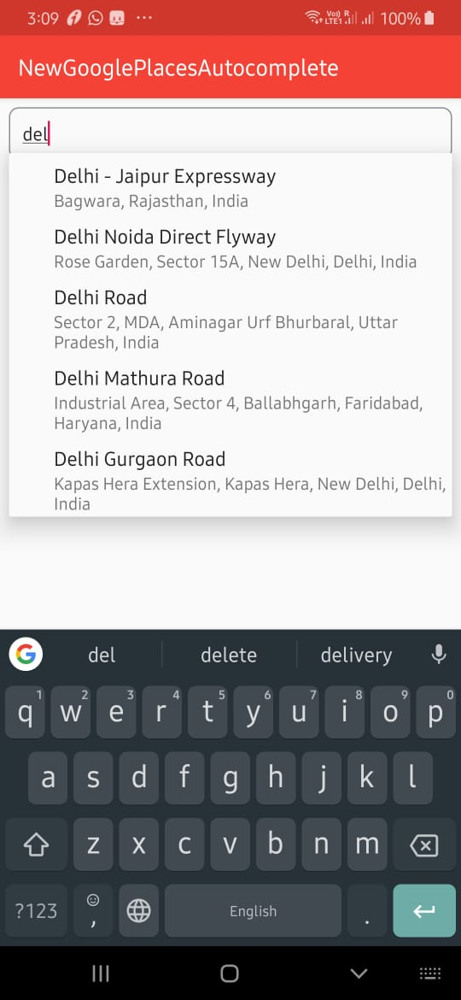
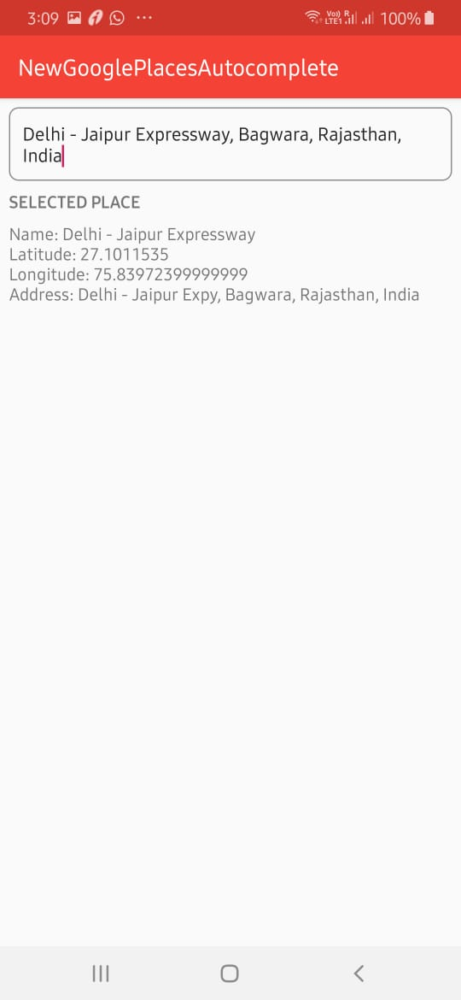

# New Google Places SDK for Android

The Google Play Services version of the Places SDK for Android (in Google Play Services 16.0.0) is deprecated as of January 29, 2019, and will be turned off on July 29, 2019. And if you check under the google API console, it only have the PLACES API and there is nothing like PLACES SDK FOR ANDROID anymore.

Migration guide to new places SDK client library can be found [here][sdk-migration]

This repo demonstrate the use of the [Google Places SDK for Android][google] with custom auto complete adapter.
For simple Google Places SDK follow this [link][simple-google].

# Get Started
To get started, your app needs to meet two requirements:
- Enable google places api in [Google Console][console-google]
- Minimun Android SDK of 18 or higher
- Don't forget to add your API key in the strings.xml file.

### Dependencies used
Add a dependency for the new SDK client library to your app-level build.gradle:

    implementation 'com.google.android.libraries.places:places:1.0.0'

## Screen Shots

[google]: <https://developers.google.com/places/android-sdk/intro>
[simple-google]: <https://github.com/googlemaps/android-places-demos>
[console-google]: <https://console.cloud.google.com>
[sdk-migration]: <https://developers.google.com/places/android-sdk/client-migration>
